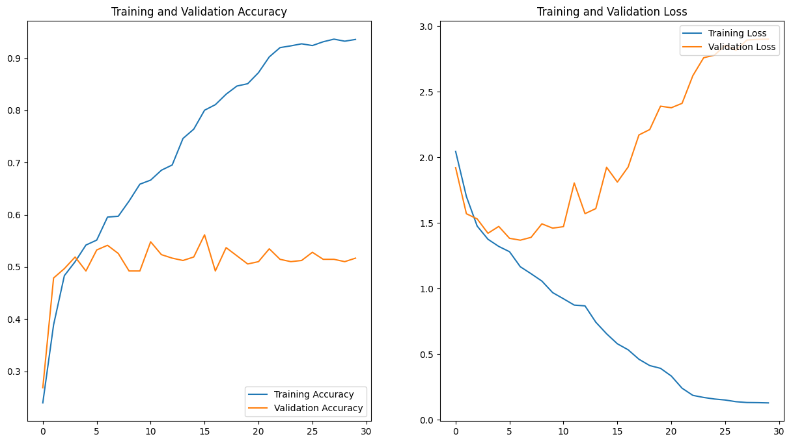
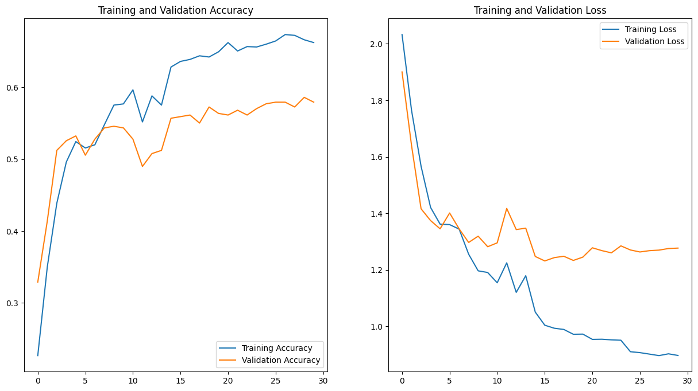
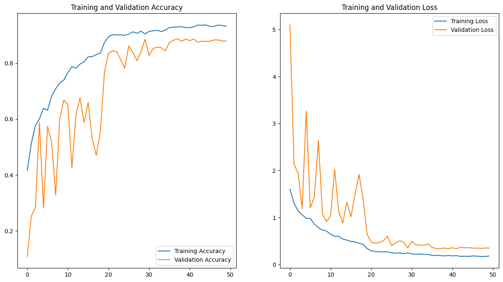

# Melanoma-Detection-Using-CNN

> This project uses a CNN to detect melanoma in images of skin lesions among 10 classes. The model predicts with an 88% accuracy.

## Table of Contents
- [General Information](#general-information)
  - [Algorithms Used](#algorithms-used)
  - [Dataset Information](#dataset-information)
- [Steps Involved](#steps-involved)
- [Results](#results)
  - [Baseline Model](#baseline-model)
  - [Augmented Model](#augmented-model)
  - [Final Model](#final-model)
- [Conclusion](#conclusion)
- [Technologies Used](#technologies-used)

<!-- You can include any other section that is pertinent to your problem -->

## General Information

### Algorithms Used

Convolutional Neural Network

### Dataset Information

The dataset consists of 2357 images of malignant and benign oncological diseases, which were formed by the International Skin Imaging Collaboration (ISIC). All images were sorted according to the classification taken with ISIC, and all subsets were divided into the same number of images, with the exception of melanomas and moles, whose images are slightly dominant.

The data set contains the following diseases:

- Actinic keratosis
- Basal cell carcinoma
- Dermatofibroma
- Melanoma
- Nevus
- Pigmented benign keratosis
- Seborrheic keratosis
- Squamous cell carcinoma
- Vascular lesion

## Steps Involved

1. **Data Reading/Data Understanding** → Defining the path for train and test images 
2. **Dataset Creation**→ Create train & validation dataset from the train directory with a batch size of 32. Also, make sure you resize your images to 180*180.
3. **Dataset visualisation** → Create a code to visualize one instance of all the nine classes present in the dataset 
4. **Model Building & training:**
    - Create a CNN model, which can accurately detect 9 classes present in the dataset. While building the model rescale images to normalize pixel values between (0,1).
    - Choose an appropriate optimiser and loss function for model training
    - Train the model for ~20 epochs
    - Write your findings after the model fit, see if there is evidence of model overfit or underfit
5. **Choose an appropriate data augmentation strategy to resolve underfitting/overfitting**
6. **Model Building & training on the augmented data :**
    - Create a CNN model, which can accurately detect 9 classes present in the dataset. While building the model rescale images to normalize pixel values between (0,1).
    - Choose an appropriate optimiser and loss function for model training
    - Train the model for ~20 epochs
    - Write your findings after the model fit, see if the earlier issue is resolved or not?
7. **Class distribution**: Examine the current class distribution in the training dataset
    - Which class has the least number of samples?
    - Which classes dominate the data in terms of the proportionate number of samples?
8. **Handling class imbalances**: Rectify class imbalances present in the training dataset with [Augmentor](https://augmentor.readthedocs.io/en/master/) library.
9. **Model Building & training on the rectified class imbalance data :**
    - Create a CNN model, which can accurately detect 9 classes present in the dataset. While building the model rescale images to normalize pixel values between (0,1).
    - Choose an appropriate optimiser and loss function for model training
    - Train the model for ~30 epochs
    

The model training may take time to train and hence you can use [Google colab](https://colab.research.google.com/).

## Results

### Baseline Model

Accuracy and Loss charts for the baseline model

### Augmented Model

Accuracy and Loss charts for the augmented model

### Final Model

Accuracy and Loss charts for the final model

# Conclusion

As the accuracy of the model increases, the loss decreases. The final model has an accuracy of 80% and a loss of 0.4. The model is able to predict the class with a high accuracy.
Augmenting the data and countering class imbalance helped in improving the accuracy of the model.

# Technologies Used

- Python
- Tensorflow
- Keras
- Augmentor
- Matplotlib
- NumPy
